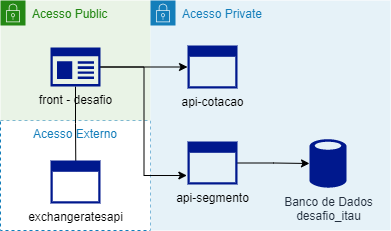

# Desafio Itaú Unibanco

### Necessidade

"A área de negócio verificou a necessidade de parametrizar o valor cobrado para compra de moedas estrangeiras por segmento de cliente, pois hoje cobramos a mesma taxa para todos os clientes." 

### Fórmula 

Formula para calcular o valor total da conversão da moeda estrangeira para Real:

> α = (β * γ) * 1 + ϕ)
>
>Onde:
> * α = valor em Reais
> * β = quantidade desejada da moeda estrangeira
> * γ = taxa de conversão da moeda estrangeira para Real
> * ϕ = taxa parametrizada por segmento

## Aplicação

Para atender a solicitação, foram criadas:
* 1 Aplicação FrontEnd - .NetCore 3.1
* 2 APIs - Angular 12
* 1 Banco de Dados - MSQLServer

### Desenho



### Execução

Seguir os passos abaixo para executar a aplicação:

1. Criar o diretório de pastas e baixar o projeto desafio-itau do Github.

```
mkdir -p ~/desafio-temp
cd ~/desafio-temp
git clone https://github.com/leonardoosse/desafio-itau.git

```

2. Subir a Aplicação, APIs e Banco de Dados.

* [Front Desafio](https://github.com/leonardoosse/desafio-itau/tree/master/front-desafio#build-e-deploy-da-api-para-valida%C3%A7%C3%A3o-local).
* [API de Cotação](https://github.com/leonardoosse/desafio-itau/tree/master/api-cotacao#build-e-deploy-da-api-para-valida%C3%A7%C3%A3o-local).
* [API de Segmento](https://github.com/leonardoosse/desafio-itau/tree/master/api-segmento#build-e-deploy-da-api-para-valida%C3%A7%C3%A3o-local).
* [Banco de Dados](https://github.com/leonardoosse/desafio-itau/tree/master/bd-desafio#build-e-deploy-da-api-para-valida%C3%A7%C3%A3o-local).

3. Após encerrar a validação, excluir o diretório baixado e limpar todas as imagens e contêineres não Utilizadas ou Pendentes.

``` 
sudo rm -r /desafio-temp
docker container prune -f
docker image prune -f
```